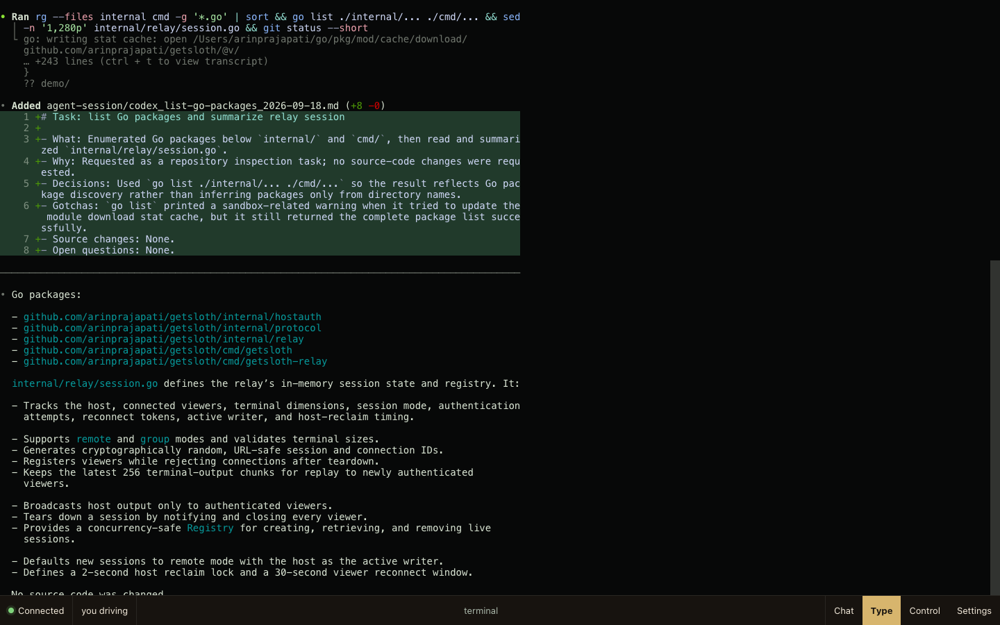
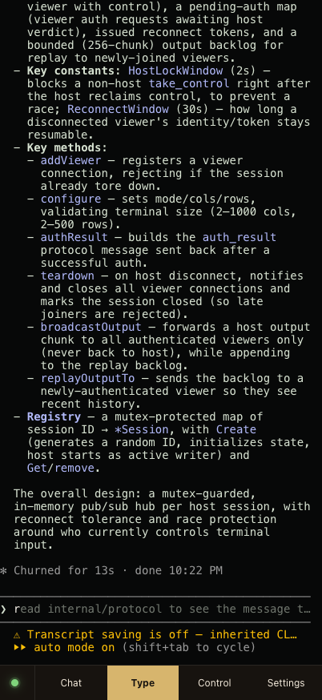

# Sloth

Control an AI coding agent session from your phone.

Sloth wraps any terminal-based command in a PTY and streams it to a
password-gated browser tab. Start a long-running agent session on your
laptop, walk away, and keep watching or steering it from your phone —
no SSH keys, no app install, nothing to configure on the viewing
device. One command on the host, one URL on the phone.

It also works for watching or handing off control between multiple
people on a team, using the same mechanism — that's a secondary use
case, not the primary one.

<p align="center">
  
</p>
<p align="center">
  
</p>

## Install

```
curl -fsSL https://getsloth.dev/install.sh | sh
```

No Go toolchain required — this downloads a prebuilt binary for your
OS/arch from [GitHub Releases](https://github.com/arinprajapati/getsloth/releases).

If you already have Go:

```
go install github.com/arinprajapati/getsloth/cmd/getsloth@latest
```

Either way it installs as `getsloth` for now; the examples below use
`sloth` — alias it if you'd rather type the short name:

```
alias sloth=getsloth
```

## Usage

```
sloth [--remote] [command [args...]]
sloth --group [command [args...]]
```

Run it in front of whatever you want to control remotely — an agent
CLI, a shell, anything that runs in a terminal:

```
sloth claude
sloth
```

It prints a share URL, a separate password, and a QR code:

```
sloth: live at https://getsloth.dev/s/<session-id>#k=<key>
sloth: password: <random>
sloth: scan to open on your phone:
<QR code>
```

Scan the QR code with your phone and you're straight in — no typing.
That works because scanning it means you're already looking at the
password printed right above it; if you send the plain URL to someone
else instead (Slack, SMS, whoever you want watching), they'll still
need to enter the password separately. Either way, the password is
checked by your own machine, not by the relay server — the relay never
sees it.

**Remote mode** (default): one other viewer can connect and take
control. Control can be handed back and forth, and the host can always
reclaim it instantly.

**Group mode** (`--group`): any number of viewers can watch and chat,
but only the host drives — nobody else can take control.

### Ending a session

The session ends when the wrapped command exits, or when you exit
Sloth (Ctrl-C). Every session is scoped to that one process — there's
no persistence beyond it.

## Self-hosting the relay

Sloth needs a relay server to broker the connection between the host
and viewers. The relay never sees your password or any terminal
content it can't already infer is encrypted — see `docs/protocol.md`
for the exact trust boundary.

Run your own:

```
go install github.com/arinprajapati/getsloth/cmd/getsloth-relay@latest
GETSLOTH_RELAY_ADDR=:8080 getsloth-relay
```

Then point the CLI at it:

```
GETSLOTH_RELAY_URL=wss://your-relay.example.com \
GETSLOTH_WEB_URL=https://your-viewer.example.com \
sloth claude
```

`GETSLOTH_WEB_URL` is where the browser viewer (the `web/` directory in
this repo) is hosted — deploy it as a static site anywhere that serves
a Vite build.

## How it works

Full wire protocol, crypto details, and the trust model are documented
in [`docs/protocol.md`](docs/protocol.md). Short version: the host
generates a fresh key pair per session, the public key travels in the
URL fragment (never sent to any server), and the relay only ever
forwards ciphertext and routing metadata — it cannot read your password
or decide who gets in.

## License

AGPL-3.0. See [`LICENSE`](LICENSE).
